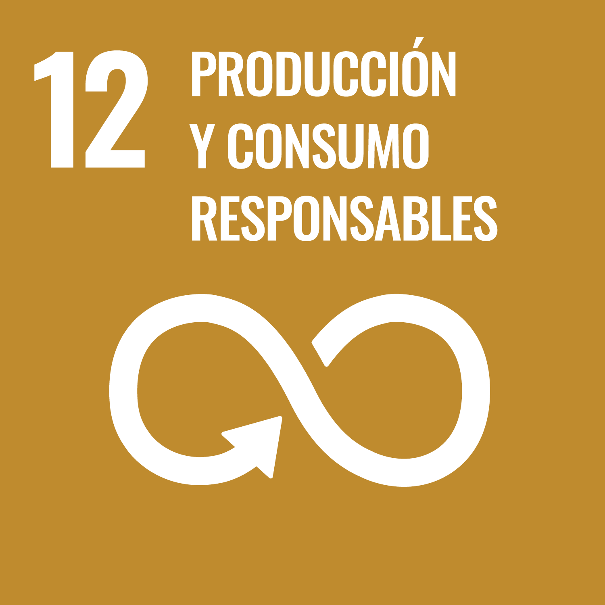

# ODS 12

## 1. ¿Cuál es el objetivo principal de este ODS según la ONU?

Garantizar modalidades de **consumo y producción sostenibles**, reduciendo el uso de recursos naturales, los desechos y los impactos ambientales y sociales a lo largo de todo el ciclo de vida de productos y servicios.

## 2. ¿Qué relación tiene con la tecnología o la informática?

La tecnología permite optimizar cadenas de suministro, medir impactos ambientales, mejorar la eficiencia energética, reducir residuos y habilitar modelos de economía circular mediante datos, automatización y trazabilidad digital.

## 3. ¿Qué problemas o retos ambientales/sociales afectan al logro de este objetivo? (describe al menos tres).

1. **Sobreexplotación de recursos naturales**: La extracción excesiva de materias primas supera la capacidad de regeneración de los ecosistemas.
2. **Generación masiva de residuos (especialmente electrónicos y plásticos)**: El reciclaje sigue siendo insuficiente y la basura mal gestionada impacta en suelos, agua y salud pública.
3. **Falta de transparencia en cadenas de suministro**: Dificulta medir impactos, detectar prácticas abusivas y garantizar producción sostenible.

## 4. ¿Cómo influye la actividad tecnológica en esos problemas (de forma positiva o negativa)?

| Positiva                   | Negativa                               |
| -------------------------- | -------------------------------------- |
| Optimiza procesos          | Genera residuos electrónicos           |
| Digitaliza la trazabilidad | Alto consumo energético                |
| Reduce consumos            | Emisiones asociadas a centros de datos |
| Permite modelos circulares | Presión sobre minerales críticos       |

## 5. ¿Qué soluciones tecnológicas podrían aplicarse para mitigarlos o resolverlos?

Sistemas _IoT_ y _blockchain_ pueden mejorar la trazabilidad y la transparencia en cadenas de suministro, reducir residuos y optimizar procesos. _IA_ para optimizar procesos y reducir desperdicio. Plataformas digitales de economía circular pueden facilitar la transición a un modelo más sostenible.

## 6. ¿Qué ejemplos o casos reales conoces (empresas, proyectos, iniciativas)?

- **Empresas**: Amazon, Tesla, Snap, Walmart.
- **Proyectos**: Proyecto "Zero Waste" de la ONU, iniciativa "Smart Cities" de la ONU.
- **Iniciativas**: Reducción de residuos en la Industria de la Tecnología, Programas de Reciclaje en la Industria de la Tecnología.

## 7. ¿Qué indicadores o métricas podrían usarse para medir el progreso hacia este ODS?

- **Reducción de residuos**: Medida por el porcentaje de reducción en la generación de residuos comparado con años anteriores.
- **Consumo energético**: Medida por el porcentaje de reducción en el consumo energético comparado con años anteriores.
- **Emisiones de gases de efecto invernadero**: Medida por la reducción en emisiones de gases de efecto invernadero en comparación con años anteriores.

## Fuentes

- [ODS 12: Garantizar modalidades de consumo y producción sostenibles](https://www.un.org/sustainabledevelopment/sustainable-consumption-production/)

## Enlaces de mis compañeros

- [ODS 8](https://amancab828.github.io/SASP_04/#ods8)
- [ODS 13](https://claudiabr14.github.io/SASP_Fase1_Web/ods/)
- [ODS 3](https://jcanleo649.github.io/SASP_04/ods3/)
