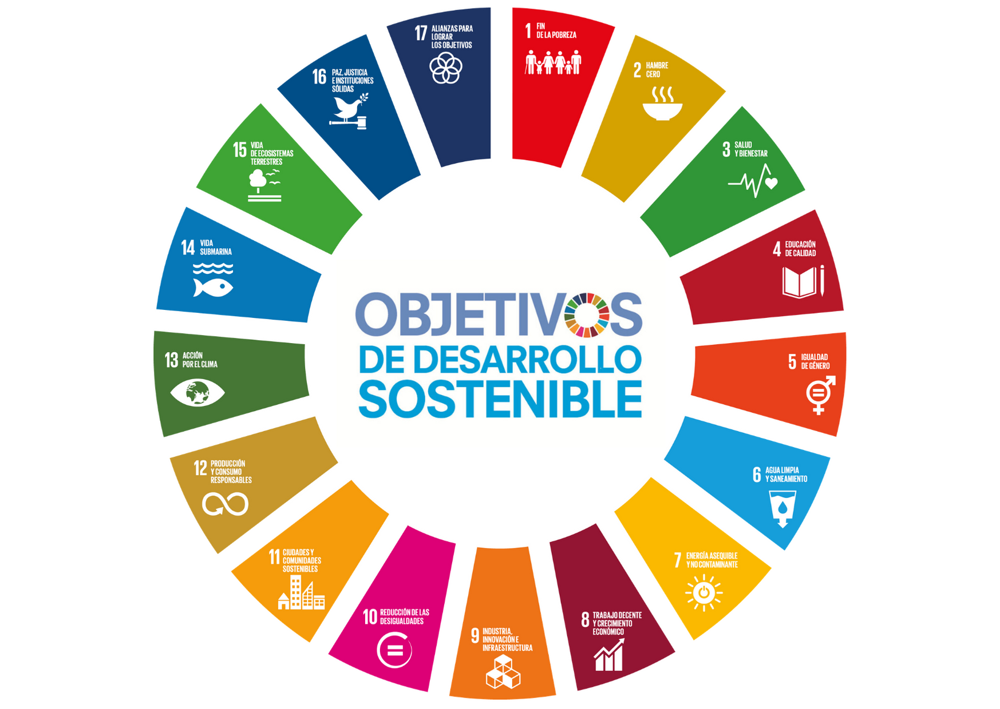

# Sostenibilidad

## 1. ¿Qué es la sostenibilidad y qué papel juega en el sector tecnológico actual?

La sostenibilidad se refiere a la capacidad de poder satisfacer las necesidades actuales sin comprometer los recursos y bienestar de las generaciones futuras.

En el sector tecnológico tiene un papel muy importante, ya que con el desarrollo de nuevas tecnologías se consumen grandes cantidades de energía y de recursos, generando a su vez grandes cantidades de residuos tecnológicos y tiene un gran impacto en el entorno social y económico. La sostenibilidad tecnológica busca equilibrar la innovación con la eficiencia energética, el uso responsable de materiales y la inclusión social.

## 2. ¿Qué dimensiones abarca (ambiental, social, económica)?

- **Ambiental**: Promueve el uso eficiente de los recursos naturales, reducción de emisiones de carbono y gestión adecuada de los residuos.
- **Social**: Impulsa la equidad, la diversidad y las condiciones laborales justas, además de facilitar el acceso universal a la tecnología.
- **Económica**: Busca la viabilidad financiera de los proyectos tecnológicos sin perjudicar los recursos naturales ni las comunidades donde operan.

## 3. ¿Qué son los aspectos ASG y por qué deben interesar a una empresa tecnológica?

Los **aspectos ASG** son un conjunto de factores que evalúan el desempeño de una empresa más allá de los resultados financieros:

- **Ambientales**: Impacto ecológico, eficiencia energética, y gestión de residuos.
- **Sociales**: Bienestar de empleados, derechos humanos, igualdad de oportunidades y contribución social.
- **Gobernanza**: Ética empresarial, transparencia, gestión de riesgos y cumplimiento normativo.

## 4. ¿Qué marcos internacionales impulsan la sostenibilidad (Agenda 2030, ODS)?

El principal marco global es la **Agenda 2030** de las Naciones Unidas, que establece **17 objetivos de Desarrollo Sostenible (ODS)**. Estos objetivos promueven un equilibrio entre crecimiento económico, bienestar social y protección ambiental. Las empresas tecnológicas pueden contribuir directamente a varios de ellos mediante la innovación digital, la eficiencia de recursos y la creación de soluciones sostenibles.

## 5. ¿Qué tres ODS están más relacionados con la informática o el desarrollo de software?

|  ODS   | Nombre                                  | Relación con la tecnología                                                                                                                                                                                   |
| :----: | --------------------------------------- | ------------------------------------------------------------------------------------------------------------------------------------------------------------------------------------------------------------ |
| ODS 9  | Industria, innovación e infraestructura | Fomenta la creación de infraestructuras tecnológicas sostenibles, el desarrollo de software innovador y la digitalización responsable de los procesos industriales.                                          |
| ODS 12 | Producción y consumo responsables       | Promueve el diseño de software y hardware con bajo consumo energético, el reciclaje de equipos electrónicos y la optimización de recursos digitales.                                                         |
| ODS 13 | Acción por el clima                     | Impulsa soluciones tecnológicas que reduzcan la huella de carbono, como sistemas de monitorización ambiental, inteligencia artificial para eficiencia energética y plataformas de sensibilización climática. |
